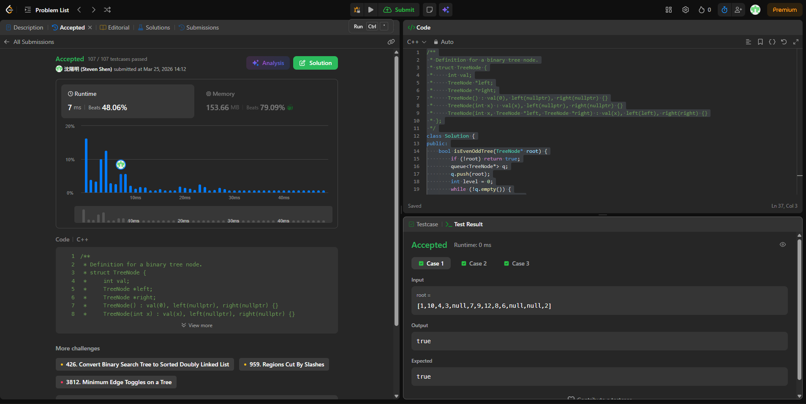

# [1609] [Even_Odd_Tree]

## Code (C++)

```cpp
/**
 * Definition for a binary tree node.
 * struct TreeNode {
 *     int val;
 *     TreeNode *left;
 *     TreeNode *right;
 *     TreeNode() : val(0), left(nullptr), right(nullptr) {}
 *     TreeNode(int x) : val(x), left(nullptr), right(nullptr) {}
 *     TreeNode(int x, TreeNode *left, TreeNode *right) : val(x), left(left), right(right) {}
 * };
 */
class Solution {
public:
    bool isEvenOddTree(TreeNode* root) {
        if (!root) return true;
        queue<TreeNode*> q;
        q.push(root);
        int level = 0;
        while (!q.empty()) {
            int size = q.size();
            int prev = level % 2 == 0 ? 0 : 1e9;
            for (int i = 0; i < size; ++i) {
                TreeNode* node = q.front(); q.pop();
                if (level % 2 == 0) {
                    if (node->val % 2 == 0 || node->val <= prev) return false;
                } else {
                    if (node->val % 2 != 0 || node->val >= prev) return false;
                }
                prev = node->val;
                if (node->left) q.push(node->left);
                if (node->right) q.push(node->right);
            }
            level++;
        }
        return true;
    }
};
```
## Acceptance Screen Shot
