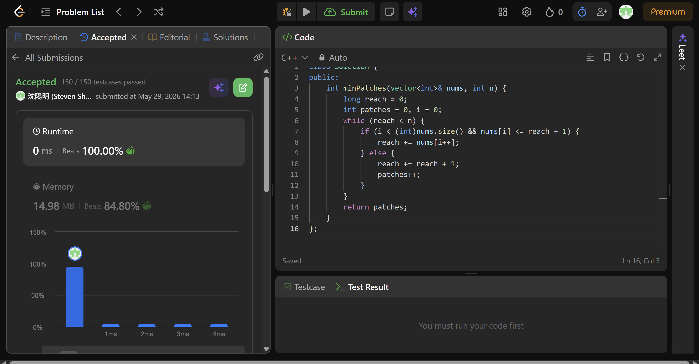

## Code (C++)

```cpp
class Solution {
public:
    int minPatches(vector<int>& nums, int n) {
        long reach = 0;
        int patches = 0, i = 0;
        while (reach < n) {
            if (i < (int)nums.size() && nums[i] <= reach + 1) {
                reach += nums[i++];
            } else {
                reach += reach + 1;
                patches++;
            }
        }
        return patches;
    }
};
```
## Acceptance Screen Shot
