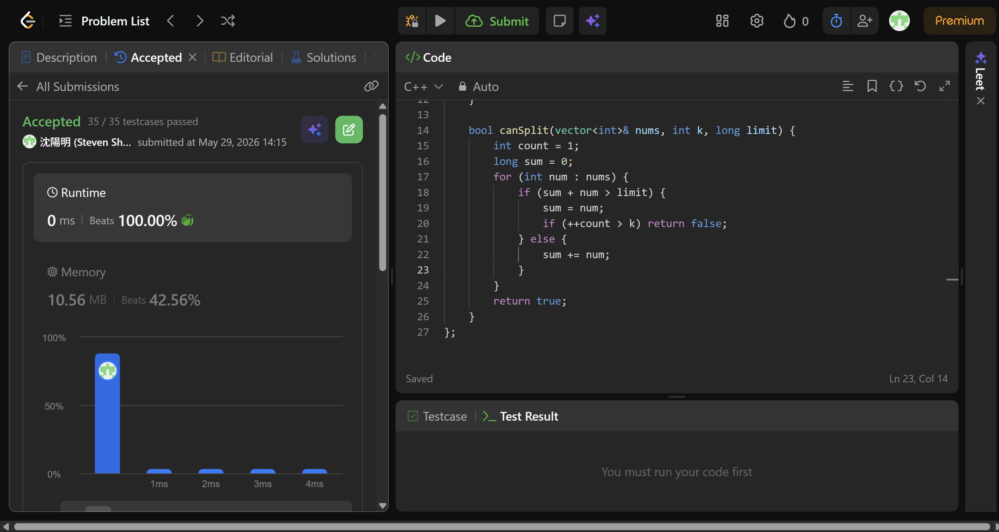

## Code (C++)

```cpp
class Solution {
public:
    int splitArray(vector<int>& nums, int k) {
        long lo = *max_element(nums.begin(), nums.end());
        long hi = accumulate(nums.begin(), nums.end(), 0L);
        while (lo < hi) {
            long mid = lo + (hi - lo) / 2;
            if (canSplit(nums, k, mid)) hi = mid;
            else lo = mid + 1;
        }
        return (int)lo;
    }

    bool canSplit(vector<int>& nums, int k, long limit) {
        int count = 1;
        long sum = 0;
        for (int num : nums) {
            if (sum + num > limit) {
                sum = num;
                if (++count > k) return false;
            } else {
                sum += num;
            }
        }
        return true;
    }
};
```
## Acceptance Screen Shot
