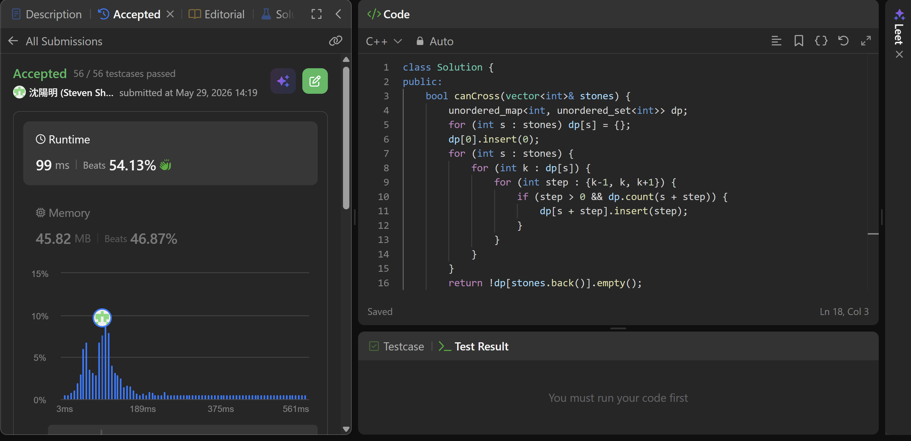

## Code (C++)

```cpp
class Solution {
public:
    bool canCross(vector<int>& stones) {
        unordered_map<int, unordered_set<int>> dp;
        for (int s : stones) dp[s] = {};
        dp[0].insert(0);
        for (int s : stones) {
            for (int k : dp[s]) {
                for (int step : {k-1, k, k+1}) {
                    if (step > 0 && dp.count(s + step)) {
                        dp[s + step].insert(step);
                    }
                }
            }
        }
        return !dp[stones.back()].empty();
    }
};
```
## Acceptance Screen Shot
