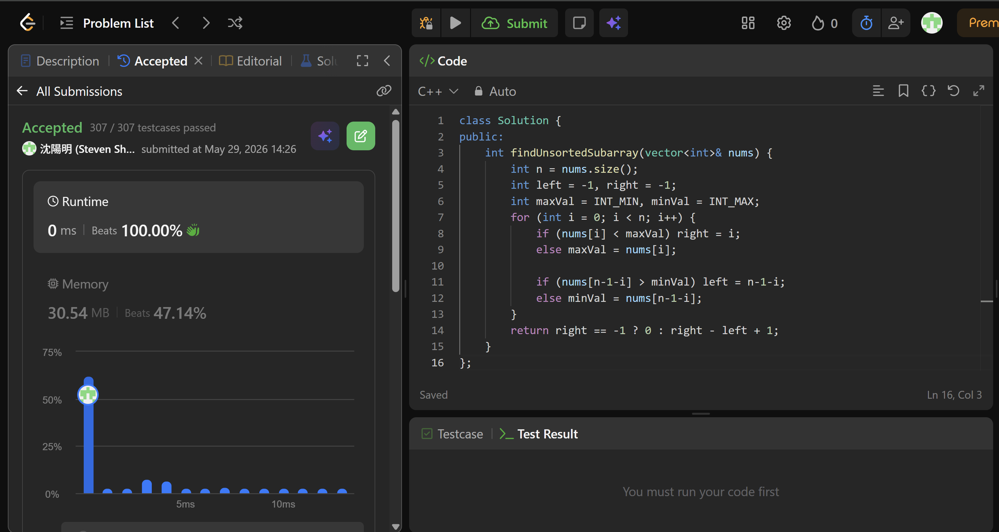

## Code (C++)

```cpp
class Solution {
public:
    int findUnsortedSubarray(vector<int>& nums) {
        int n = nums.size();
        int left = -1, right = -1;
        int maxVal = INT_MIN, minVal = INT_MAX;
        for (int i = 0; i < n; i++) {
            if (nums[i] < maxVal) right = i;
            else maxVal = nums[i];

            if (nums[n-1-i] > minVal) left = n-1-i;
            else minVal = nums[n-1-i];
        }
        return right == -1 ? 0 : right - left + 1;
    }
};
```
## Acceptance Screen Shot
