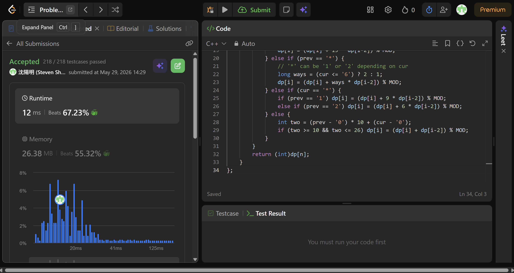

## Code (C++)

```cpp
class Solution {
public:
    int numDecodings(string s) {
        const long MOD = 1e9 + 7;
        int n = s.size();
        vector<long> dp(n+1, 0);
        dp[0] = 1;
        dp[1] = s[0] == '0' ? 0 : (s[0] == '*' ? 9 : 1);

        for (int i = 2; i <= n; i++) {
            char cur = s[i-1], prev = s[i-2];

            // Single character decode
            if (cur == '*') dp[i] = 9 * dp[i-1] % MOD;
            else if (cur != '0') dp[i] = dp[i-1];

            // Two character decode
            if (prev == '*' && cur == '*') {
                dp[i] = (dp[i] + 15 * dp[i-2]) % MOD;
            } else if (prev == '*') {
                // '*' can be '1' or '2' depending on cur
                long ways = (cur <= '6') ? 2 : 1;
                dp[i] = (dp[i] + ways * dp[i-2]) % MOD;
            } else if (cur == '*') {
                if (prev == '1') dp[i] = (dp[i] + 9 * dp[i-2]) % MOD;
                else if (prev == '2') dp[i] = (dp[i] + 6 * dp[i-2]) % MOD;
            } else {
                int two = (prev - '0') * 10 + (cur - '0');
                if (two >= 10 && two <= 26) dp[i] = (dp[i] + dp[i-2]) % MOD;
            }
        }
        return (int)dp[n];
    }
};
```
## Acceptance Screen Shot
