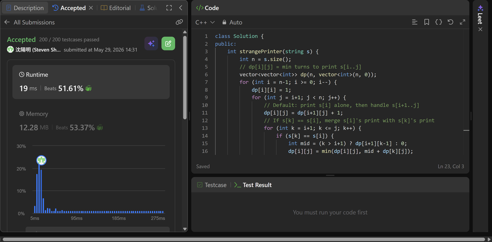

## Code (C++)

```cpp
class Solution {
public:
    int strangePrinter(string s) {
        int n = s.size();
        // dp[i][j] = min turns to print s[i..j]
        vector<vector<int>> dp(n, vector<int>(n, 0));
        for (int i = n-1; i >= 0; i--) {
            dp[i][i] = 1;
            for (int j = i+1; j < n; j++) {
                // Default: print s[i] alone, then handle s[i+1..j]
                dp[i][j] = dp[i+1][j] + 1;
                // If s[k] == s[i], merge s[i]'s print with s[k]'s print
                for (int k = i+1; k <= j; k++) {
                    if (s[k] == s[i]) {
                        int mid = (k > i+1) ? dp[i+1][k-1] : 0;
                        dp[i][j] = min(dp[i][j], mid + dp[k][j]);
                    }
                }
            }
        }
        return dp[0][n-1];
    }
};
```
## Acceptance Screen Shot
