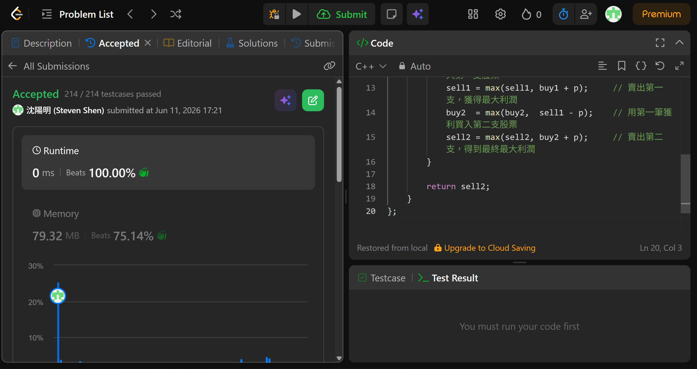

## Code (C++)

```cpp
class Solution {
public:
    int maxProfit(vector<int>& prices) {
        // 用四個狀態變數模擬最多兩筆交易的 DP
        // buy1  = 完成第一次「買入」後的最大利潤（負數代表花費）
        // sell1 = 完成第一次「賣出」後的最大利潤
        // buy2  = 完成第二次「買入」後的最大利潤（用 sell1 的收益去買）
        // sell2 = 完成第二次「賣出」後的最大利潤（最終答案）
        int buy1 = INT_MIN, sell1 = 0, buy2 = INT_MIN, sell2 = 0;

        for (int p : prices) {
            buy1  = max(buy1,  -p);           // 以最低價買入第一支股票
            sell1 = max(sell1, buy1 + p);     // 賣出第一支，獲得最大利潤
            buy2  = max(buy2,  sell1 - p);    // 用第一筆獲利買入第二支股票
            sell2 = max(sell2, buy2 + p);     // 賣出第二支，得到最終最大利潤
        }

        return sell2;
    }
};
```
## Acceptance Screen Shot
