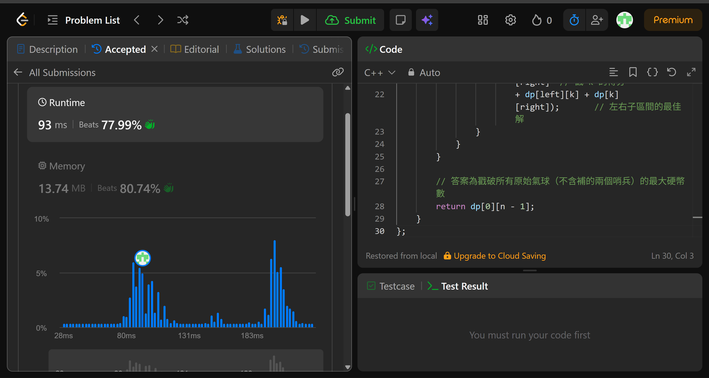

## Code (C++)

```cpp
class Solution {
public:
    int maxCoins(vector<int>& nums) {
        // 在兩端各補 1，避免邊界越界的特判
        nums.insert(nums.begin(), 1);
        nums.push_back(1);
        int n = nums.size();

        // dp[left][right] = 戳破 (left, right) 開區間內所有氣球能得到的最大硬幣數
        // 關鍵思路：逆向思考，令 k 為「最後一個被戳破」的氣球
        // 此時左右鄰居已確定是 nums[left] 和 nums[right]，得分 = nums[left]*nums[k]*nums[right]
        vector<vector<int>> dp(n, vector<int>(n, 0));

        // 從小區間往大區間推（len = 區間長度，至少需要 3 個點才有內部氣球）
        for (int len = 2; len < n; len++) {
            for (int left = 0; left < n - len; left++) {
                int right = left + len;
                // 枚舉 k 作為 (left, right) 內最後被戳的氣球
                for (int k = left + 1; k < right; k++) {
                    dp[left][right] = max(dp[left][right],
                        nums[left] * nums[k] * nums[right]  // 戳 k 的得分
                        + dp[left][k] + dp[k][right]);       // 左右子區間的最佳解
                }
            }
        }

        // 答案為戳破所有原始氣球（不含補的兩個哨兵）的最大硬幣數
        return dp[0][n - 1];
    }
};
```
## Acceptance Screen Shot
