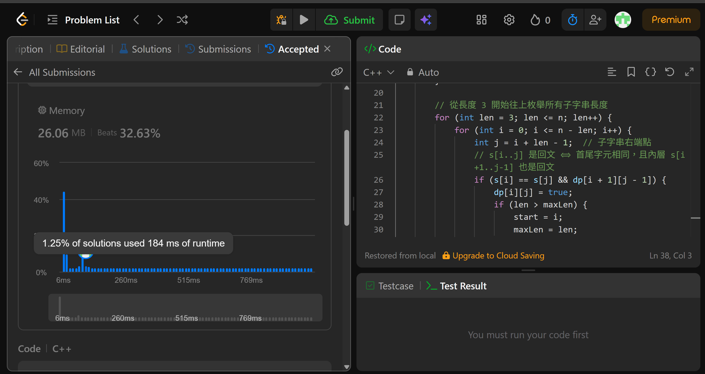

## Code (C++)

```cpp
class Solution {
public:
    string longestPalindrome(string s) {
        int n = s.size(), start = 0, maxLen = 1;

        // dp[i][j] = true 表示 s[i..j] 是回文子字串
        vector<vector<bool>> dp(n, vector<bool>(n, false));

        // 基本情況：單一字元必定是回文
        for (int i = 0; i < n; i++) dp[i][i] = true;

        // 基本情況：長度為 2，兩字元相同即為回文
        for (int i = 0; i < n - 1; i++) {
            if (s[i] == s[i + 1]) {
                dp[i][i + 1] = true;
                start = i;
                maxLen = 2;
            }
        }

        // 從長度 3 開始往上枚舉所有子字串長度
        for (int len = 3; len <= n; len++) {
            for (int i = 0; i <= n - len; i++) {
                int j = i + len - 1;  // 子字串右端點
                // s[i..j] 是回文 ⟺ 首尾字元相同，且內層 s[i+1..j-1] 也是回文
                if (s[i] == s[j] && dp[i + 1][j - 1]) {
                    dp[i][j] = true;
                    if (len > maxLen) {
                        start = i;
                        maxLen = len;
                    }
                }
            }
        }

        return s.substr(start, maxLen);
    }
};
```
## Acceptance Screen Shot

