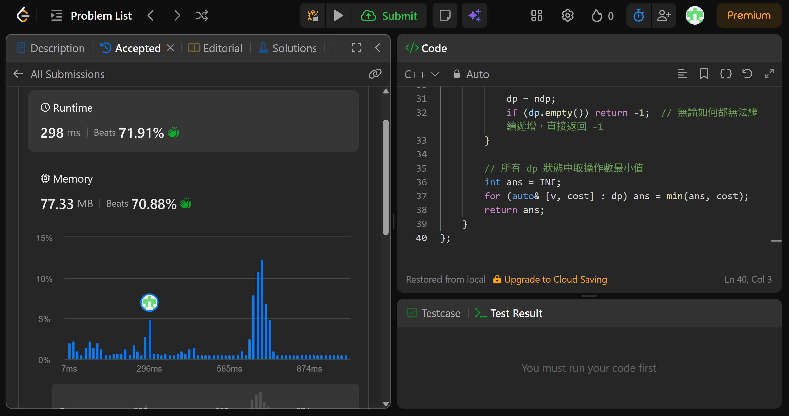

## Code (C++)

```cpp
class Solution {
public:
    int makeArrayIncreasing(vector<int>& arr1, vector<int>& arr2) {
        // 排序並去重 arr2，方便後續用二分搜尋找最小可替換值
        sort(arr2.begin(), arr2.end());
        arr2.erase(unique(arr2.begin(), arr2.end()), arr2.end());

        const int INF = 1e9;
        // dp 為 map：「目前位置的實際值」→「達到此狀態的最少操作數」
        // 用 -1 作為起始哨兵（比所有合法值都小）
        map<int, int> dp;
        dp[-1] = 0;

        for (int x : arr1) {
            map<int, int> ndp;  // 處理完當前位置後的新狀態

            for (auto& [prev, cost] : dp) {
                // 選擇一：保留 arr1[i] 原值
                // 條件：必須嚴格大於前一個值 prev
                if (x > prev)
                    ndp[x] = min(ndp.count(x) ? ndp[x] : INF, cost);

                // 選擇二：從 arr2 中替換當前位置（操作數 +1）
                // 貪心：取 arr2 中大於 prev 的最小值即可
                // 理由：較小的替換值對後續位置的限制更寬鬆，永遠不差於取較大值
                auto it = upper_bound(arr2.begin(), arr2.end(), prev);
                if (it != arr2.end())
                    ndp[*it] = min(ndp.count(*it) ? ndp[*it] : INF, cost + 1);
            }

            dp = ndp;
            if (dp.empty()) return -1;  // 無論如何都無法繼續遞增，直接返回 -1
        }

        // 所有 dp 狀態中取操作數最小值
        int ans = INF;
        for (auto& [v, cost] : dp) ans = min(ans, cost);
        return ans;
    }
};
```
## Acceptance Screen Shot
