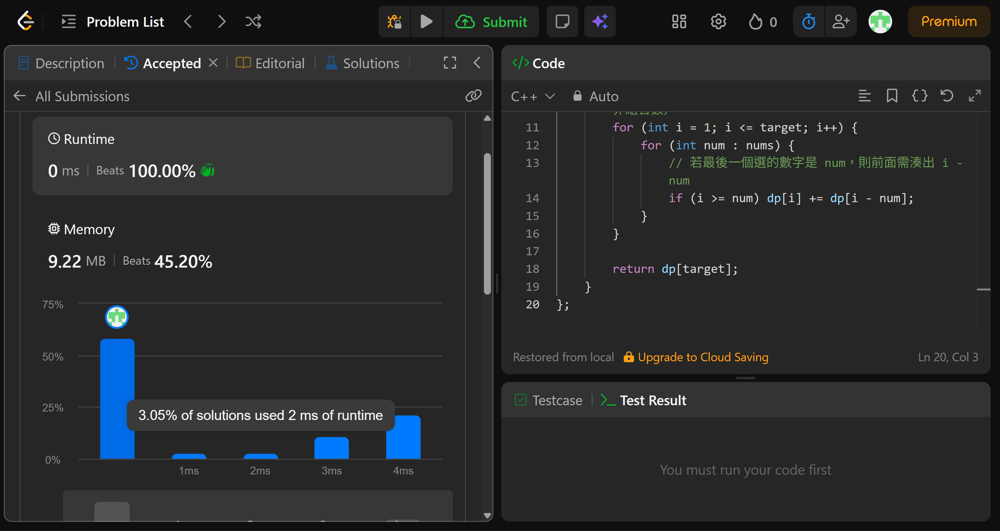

## Code (C++)

```cpp
class Solution {
public:
    int combinationSum4(vector<int>& nums, int target) {
        // dp[i] = 加總等於 i 的有序組合數（順序不同視為不同組合）
        // 使用 unsigned int 避免大數相加時溢位
        vector<unsigned int> dp(target + 1, 0);
        dp[0] = 1;  // 空組合（不選任何數）也算一種方式，作為遞推基底

        // 外層枚舉目標值 i，內層枚舉每個可用數字
        // 這樣的枚舉順序確保「不同順序視為不同組合」（排列數而非組合數）
        for (int i = 1; i <= target; i++) {
            for (int num : nums) {
                // 若最後一個選的數字是 num，則前面需湊出 i - num
                if (i >= num) dp[i] += dp[i - num];
            }
        }

        return dp[target];
    }
};
```
## Acceptance Screen Shot
