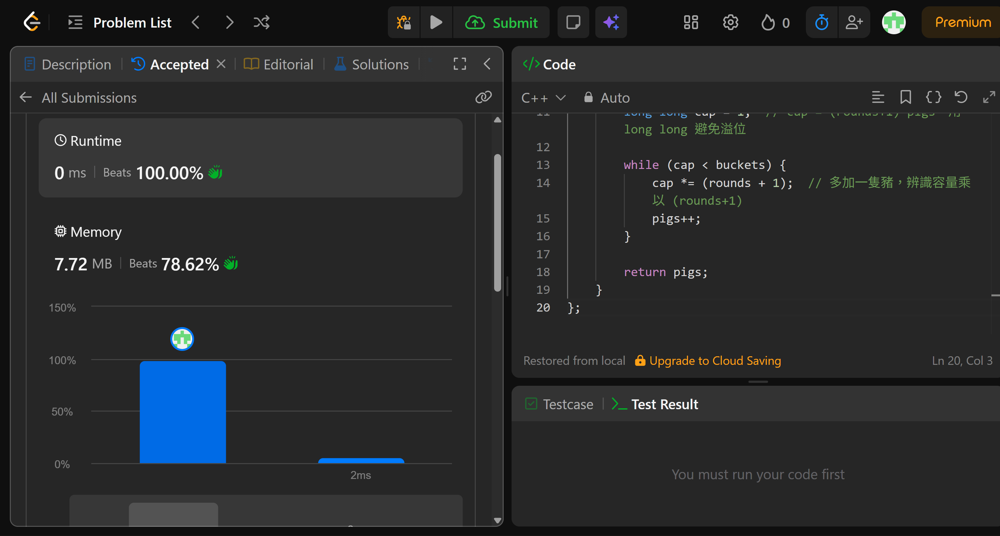

## Code (C++)

```cpp
class Solution {
public:
    int poorPigs(int buckets, int minutesToDie, int minutesToTest) {
        // 核心數學推導：
        // 可進行的測試輪數 rounds = minutesToTest / minutesToDie
        // 每隻豬有 (rounds + 1) 種可能結果：在第 1, 2, ..., rounds 輪死亡，或全程存活
        // p 隻豬合起來能區分的桶數上限 = (rounds + 1)^p（類似 p 位的 (rounds+1) 進位數）
        // 因此求最小 p 使得 (rounds + 1)^p >= buckets
        int rounds = minutesToTest / minutesToDie;
        int pigs = 0;
        long long cap = 1;  // cap = (rounds+1)^pigs，用 long long 避免溢位

        while (cap < buckets) {
            cap *= (rounds + 1);  // 多加一隻豬，辨識容量乘以 (rounds+1)
            pigs++;
        }

        return pigs;
    }
};
```
## Acceptance Screen Shot
