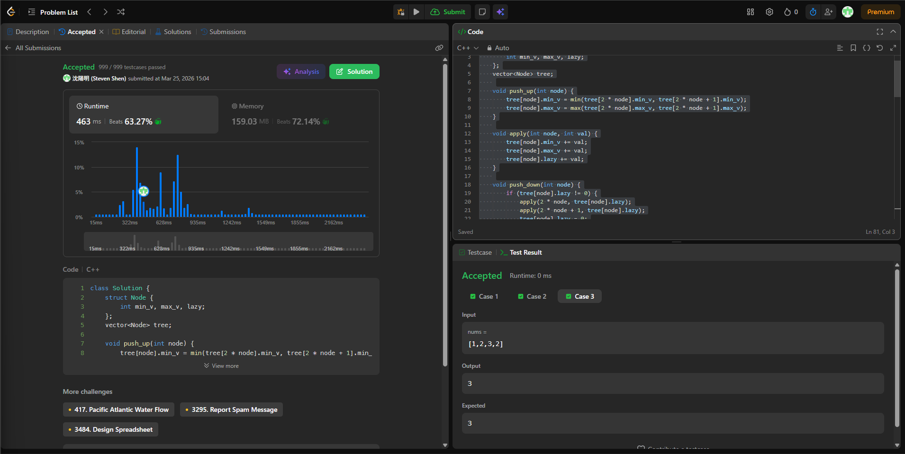

# [3721] [Longest_Balanced_Subarray_II]

## Code (C++)

```cpp
class Solution {
    struct Node {
        int min_v, max_v, lazy;
    };
    vector<Node> tree;
    
    void push_up(int node) {
        tree[node].min_v = min(tree[2 * node].min_v, tree[2 * node + 1].min_v);
        tree[node].max_v = max(tree[2 * node].max_v, tree[2 * node + 1].max_v);
    }
    
    void apply(int node, int val) {
        tree[node].min_v += val;
        tree[node].max_v += val;
        tree[node].lazy += val;
    }
    
    void push_down(int node) {
        if (tree[node].lazy != 0) {
            apply(2 * node, tree[node].lazy);
            apply(2 * node + 1, tree[node].lazy);
            tree[node].lazy = 0;
        }
    }
    
    // 區間更新：將 [ql, qr] 範圍內的值加上 val
    void update(int node, int l, int r, int ql, int qr, int val) {
        if (ql > r || qr < l) return;
        if (ql <= l && r <= qr) {
            apply(node, val);
            return;
        }
        push_down(node);
        int mid = l + (r - l) / 2;
        update(2 * node, l, mid, ql, qr, val);
        update(2 * node + 1, mid + 1, r, ql, qr, val);
        push_up(node);
    }
    
    // 查詢區間內「最左邊的 0」的位置
    int query_first_zero(int node, int l, int r, int ql, int qr) {
        if (ql > r || qr < l) return -1;
        // 如果這個區間的最大值小於 0，或最小值大於 0，代表裡面絕對沒有 0
        if (tree[node].min_v > 0 || tree[node].max_v < 0) return -1;
        // 找到了具體的葉子節點
        if (l == r) return l;
        
        push_down(node);
        int mid = l + (r - l) / 2;
        // 優先找左子樹（因為我們要找最左邊的 0，讓長度最長）
        int res = query_first_zero(2 * node, l, mid, ql, qr);
        if (res != -1) return res;
        // 左邊沒有再找右邊
        return query_first_zero(2 * node + 1, mid + 1, r, ql, qr);
    }

public:
    int longestBalanced(vector<int>& nums) {
        int n = nums.size();
        tree.assign(4 * n, {0, 0, 0}); // 初始化線段樹
        unordered_map<int, int> last_pos; // 記錄每個數字「最後一次出現」的索引
        int max_len = 0;
        
        for (int j = 0; j < n; ++j) {
            int x = nums[j];
            int prev = last_pos.count(x) ? last_pos[x] : -1;
            int val = (x % 2 == 0) ? 1 : -1;
            
            // 只有在這個數字「前一次出現位置 + 1」到「現在位置」的範圍內，相異數量才會改變
            update(1, 0, n - 1, prev + 1, j, val);
            last_pos[x] = j;
            
            // 找出 [0, j] 範圍內，最早出現 D=0 的位置 i
            int first_zero = query_first_zero(1, 0, n - 1, 0, j);
            if (first_zero != -1) {
                max_len = max(max_len, j - first_zero + 1);
            }
        }
        return max_len;
    }
};
```
## Acceptance Screen Shot
