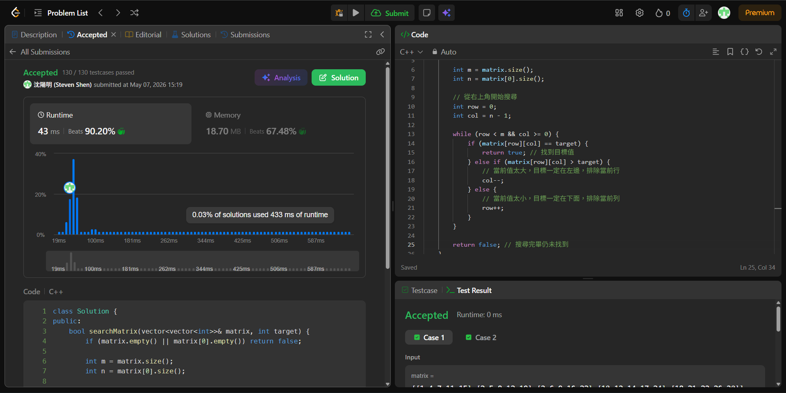

# [240] [Search_a_2D_Matrix_II]

## Code (C++)

```cpp
class Solution {
public:
    vector<vector<int>> getSkyline(vector<vector<int>>& buildings) {
        if (buildings.empty()) return {};
        return divideAndConquer(buildings, 0, buildings.size() - 1);
    }
    
private:
    vector<vector<int>> divideAndConquer(vector<vector<int>>& buildings, int left, int right) {
        // Base case: 只有一棟建築物
        if (left == right) {
            return {{buildings[left][0], buildings[left][2]}, 
                    {buildings[left][1], 0}};
        }
        
        int mid = left + (right - left) / 2;
        // 分割成兩半
        vector<vector<int>> leftSkyline = divideAndConquer(buildings, left, mid);
        vector<vector<int>> rightSkyline = divideAndConquer(buildings, mid + 1, right);
        
        // 合併兩個天際線
        return merge(leftSkyline, rightSkyline);
    }
    
    vector<vector<int>> merge(vector<vector<int>>& sky1, vector<vector<int>>& sky2) {
        vector<vector<int>> merged;
        int h1 = 0, h2 = 0; // 分別記錄 sky1 和 sky2 目前的有效高度
        int i = 0, j = 0;
        
        while (i < sky1.size() && j < sky2.size()) {
            int x, h;
            // 挑選 x 座標較小的點
            if (sky1[i][0] < sky2[j][0]) {
                x = sky1[i][0];
                h1 = sky1[i][1];
                i++;
            } else if (sky1[i][0] > sky2[j][0]) {
                x = sky2[j][0];
                h2 = sky2[j][1];
                j++;
            } else { // x 座標相同，同時處理
                x = sky1[i][0];
                h1 = sky1[i][1];
                h2 = sky2[j][1];
                i++; j++;
            }
            
            // 當前這點的最高高度
            h = max(h1, h2);
            
            // 確保沒有連續相同高度的點
            if (merged.empty() || merged.back()[1] != h) {
                merged.push_back({x, h});
            }
        }
        
        // 把剩下的點加入
        while (i < sky1.size()) merged.push_back(sky1[i++]);
        while (j < sky2.size()) merged.push_back(sky2[j++]);
        
        return merged;
    }
};
```
## Acceptance Screen Shot

