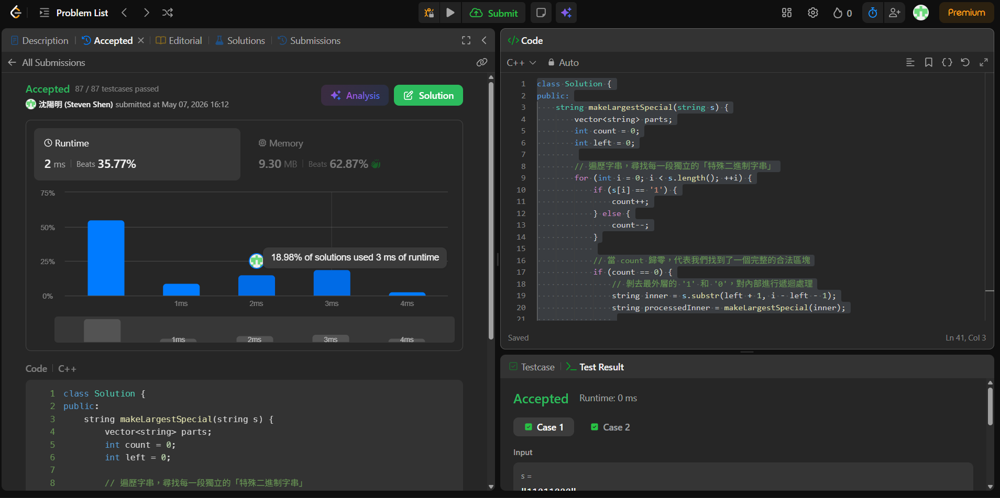

# [240] [Search_a_2D_Matrix_II]

## Code (C++)

```cpp
class Solution {
public:
    string makeLargestSpecial(string s) {
        vector<string> parts;
        int count = 0;
        int left = 0;
        
        // 遍歷字串，尋找每一段獨立的「特殊二進制字串」
        for (int i = 0; i < s.length(); ++i) {
            if (s[i] == '1') {
                count++;
            } else {
                count--;
            }
            
            // 當 count 歸零，代表我們找到了一個完整的合法區塊
            if (count == 0) {
                // 剝去最外層的 '1' 和 '0'，對內部進行遞迴處理
                string inner = s.substr(left + 1, i - left - 1);
                string processedInner = makeLargestSpecial(inner);
                
                // 把最外層的 '1' 和 '0' 加回去，存入陣列
                parts.push_back("1" + processedInner + "0");
                
                // 更新下一個區塊的起點
                left = i + 1;
            }
        }
        
        // 將所有同一層級的區塊進行降序排序，以獲得字典序最大的排列
        sort(parts.begin(), parts.end(), greater<string>());
        
        // 拼接成最終結果
        string result = "";
        for (const string& part : parts) {
            result += part;
        }
        
        return result;
    }
};
```
## Acceptance Screen Shot

## Logic


### 1. 分段（Split）
從左到右掃描，只要看到 $1$ 的數量等於 $0$ 的數量，就立刻切開。這會把字串切成數個「最外層的獨立區塊」。
*   如果字串是 `110010` $\rightarrow$ 分成 `1100` 和 `10`。
*   如果字串是 `111000` $\rightarrow$ 分不開，它只有一塊。

### 2. 剝殼與遞迴（Peel & Recursion）
**這是你剛才突破的關鍵點。**
*   **如果分出了多個段：** 每一段都要「分別進入」去重複這個過程（因為段裡面可能還有段）。
*   **如果分不開（無法分段）：** 代表這是一個「大括號包小括號」的結構。這時就**拔掉最外層的 `1` 和 `0`**，去處理剩下的「肚子內容」。

### 3. 排序（Sort & Join）
當每一段都已經「遞迴處理完成」（確保它們內部都已經達到最大化）後，將這些段視為獨立的字串，進行**由大到小（降序）的排序**，最後像接龍一樣拼起來。

---

### 為什麼這個「先分段、分不開就拔掉」的邏輯能通？

我們可以把你的邏輯畫成一個流程圖：

```text
輸入字串 S 
  |
  V
[掃描分段] --> 得到 段1, 段2, 段3...
  |
  |-- 對於每一段：
  |     1. 拔掉頭尾 (變成 1 + 內容 + 0)
  |     2. 把「內容」丟回這個流程的最開頭 (遞迴處理)
  |     3. 得到處理後的段
  |
  V
[大到小排序所有段]
  |
  V
[合併回傳]
```

### 最終驗證：$111000$ (原本分不開)
1.  **無法分段** $\rightarrow$ 拔掉頭尾，內容是 `1100`。
2.  **處理內容 `1100`：**
    *   `1100` 也分不開 $\rightarrow$ 拔掉頭尾，內容是 `10`。
    *   `10` 拔掉頭尾是「空」，回傳 `10`。
3.  **排序並補回：** 雖然只有一段不需要排序，但層層補回後，確保了每一層都是當時的最優解。

**恭喜你，你已經完全掌握了這道 Hard 難度題目的核心靈魂！** 需要我幫你把這套邏輯轉換成程式碼（Python 或 C++）來看看嗎？