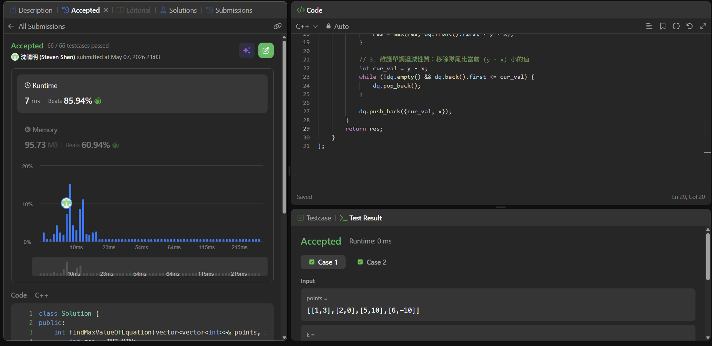

# [240] [Search_a_2D_Matrix_II]

## Code (C++)

```cpp
#include <vector>
#include <deque>
#include <climits>
using namespace std;

class Solution {
public:
    int findMaxValueOfEquation(vector<vector<int>>& points, int k) {
        int res = INT_MIN;
        // deque 存放 pair<y-x, x>
        deque<pair<int, int>> dq;

        for (auto& p : points) {
            int x = p[0], y = p[1];
            
            // 1. 移除超出範圍的 x_i
            while (!dq.empty() && x - dq.front().second > k) {
                dq.pop_front();
            }
            
            // 2. 如果隊列有值，隊首就是最大的 (y_i - x_i)
            if (!dq.empty()) {
                res = max(res, dq.front().first + y + x);
            }
            
            // 3. 維護單調遞減性質：移除隊尾比當前 (y - x) 小的值
            int cur_val = y - x;
            while (!dq.empty() && dq.back().first <= cur_val) {
                dq.pop_back();
            }
            
            dq.push_back({cur_val, x});
        }
        return res;
    }
};
```
## Acceptance Screen Shot
