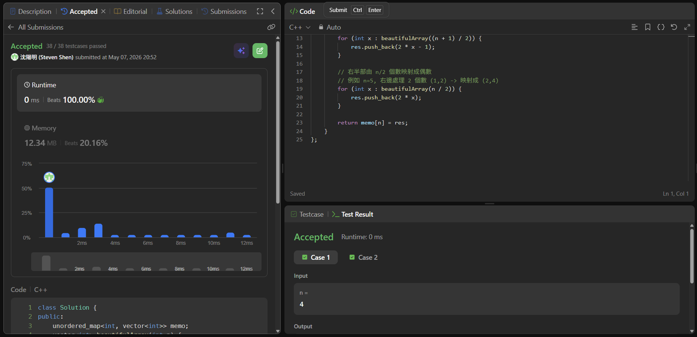

# [240] [Search_a_2D_Matrix_II]

## Code (C++)

```cpp
#include <vector>
#include <unordered_map>

using namespace std;

class Solution {
    // 使用 Memoization 減少重複計算
    unordered_map<int, vector<int>> memo;

public:
    vector<int> beautifulArray(int n) {
        // 基礎情況
        if (n == 1) return {1};
        if (memo.count(n)) return memo[n];

        vector<int> res;
        
        // 分治：左半部由 (n+1)/2 個數映射成奇數
        // 例如 n=5, 左邊處理 3 個數 (1,2,3) -> 映射成 (1,3,5)
        for (int x : beautifulArray((n + 1) / 2)) {
            res.push_back(2 * x - 1);
        }
        
        // 右半部由 n/2 個數映射成偶數
        // 例如 n=5, 右邊處理 2 個數 (1,2) -> 映射成 (2,4)
        for (int x : beautifulArray(n / 2)) {
            res.push_back(2 * x);
        }

        return memo[n] = res;
    }
};
```
## Acceptance Screen Shot
