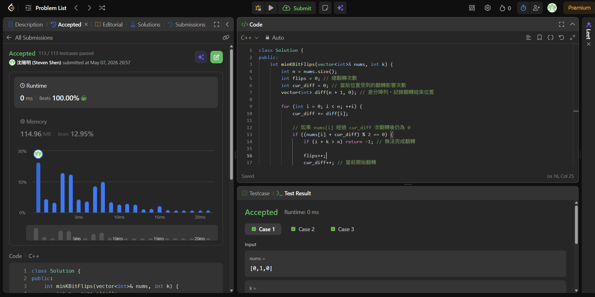

# [240] [Search_a_2D_Matrix_II]

## Code (C++)

```cpp
class Solution {
public:
    int minKBitFlips(vector<int>& nums, int k) {
        int n = nums.size();
        int flips = 0; // 總翻轉次數
        int cur_diff = 0; // 當前位置受到的翻轉影響次數
        vector<int> diff(n + 1, 0); // 差分陣列，記錄翻轉結束位置

        for (int i = 0; i < n; ++i) {
            cur_diff += diff[i];
            
            // 如果 nums[i] 經過 cur_diff 次翻轉後仍為 0
            if ((nums[i] + cur_diff) % 2 == 0) {
                if (i + k > n) return -1; // 無法完成翻轉
                
                flips++;
                cur_diff++; // 當前開始翻轉
                diff[i + k]--; // 在 k 長度後結束影響
            }
        }
        return flips;
    }
};
```
## Acceptance Screen Shot
