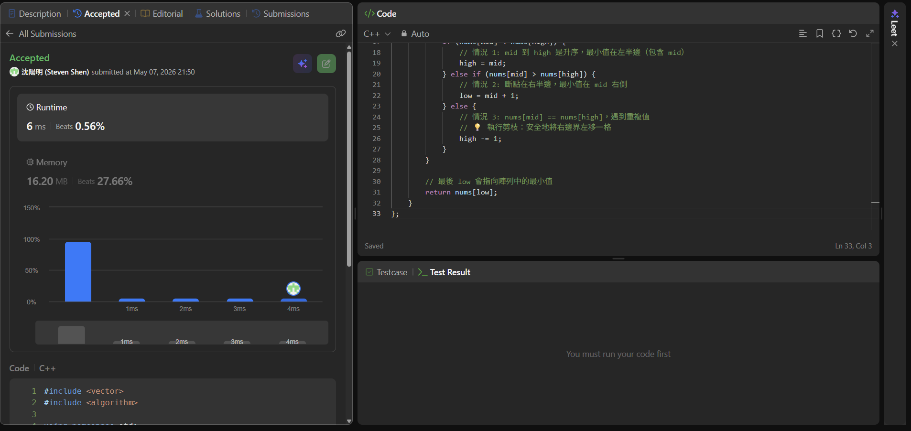

# [240] [Search_a_2D_Matrix_II]

## Code (C++)

```cpp
#include <vector>
#include <algorithm>

using namespace std;

class Solution {
public:
    int findMin(vector<int>& nums) {
        int low = 0;
        int high = nums.size() - 1;

        // 當 low == high 時，代表我們已經鎖定了唯一的最小值
        while (low < high) {
            // 💡 重新計算這一輪的 mid
            int mid = low + (high - low) / 2;

            if (nums[mid] < nums[high]) {
                // 情況 1: mid 到 high 是升序，最小值在左半邊（包含 mid）
                high = mid;
            } else if (nums[mid] > nums[high]) {
                // 情況 2: 斷點在右半邊，最小值在 mid 右側
                low = mid + 1;
            } else {
                // 情況 3: nums[mid] == nums[high]，遇到重複值
                // 💡 執行剪枝：安全地將右邊界左移一格
                high -= 1;
            }
        }

        // 最後 low 會指向陣列中的最小值
        return nums[low];
    }
};
```
## Acceptance Screen Shot
