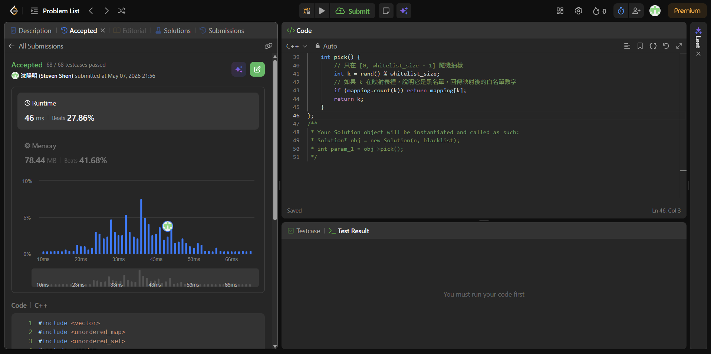

# [240] [Search_a_2D_Matrix_II]

## Code (C++)

```cpp
#include <vector>
#include <unordered_map>
#include <unordered_set>
#include <random>

using namespace std;

class Solution {
private:
    unordered_map<int, int> mapping;
    int whitelist_size;

public:
    Solution(int n, vector<int>& blacklist) {
        int b_size = blacklist.size();
        whitelist_size = n - b_size;
        
        // 1. 先把黑名單放入 set 方便快速查詢
        unordered_set<int> b_set;
        for (int b : blacklist) b_set.insert(b);

        // 2. 找出大於等於 whitelist_size 區間內的「好數字」
        int last = n - 1;
        for (int b : blacklist) {
            // 如果這個黑名單數字本來就在「黑名單候選區」，不用處理
            if (b >= whitelist_size) continue;
            
            // 找到一個在候選區內且不在黑名單中的「好數字」
            while (b_set.count(last)) {
                last--;
            }
            
            // 建立映射：把白名單區間的「壞掉位置」指向後方的「好數字」
            mapping[b] = last;
            last--;
        }
    }
    
    int pick() {
        // 只在 [0, whitelist_size - 1] 隨機抽樣
        int k = rand() % whitelist_size;
        // 如果 k 在映射表裡，說明它是黑名單，回傳映射後的白名單數字
        if (mapping.count(k)) return mapping[k];
        return k;
    }
};
```
## Acceptance Screen Shot
