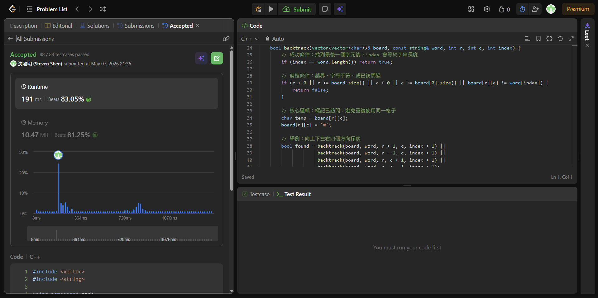

# [240] [Search_a_2D_Matrix_II]

## Code (C++)

```cpp
#include <vector>
#include <string>

using namespace std;

class Solution {
public:
    bool exist(vector<vector<char>>& board, string word) {
        int m = board.size();
        int n = board[0].size();
        
        // 從每一個格子出發嘗試
        for (int i = 0; i < m; ++i) {
            for (int j = 0; j < n; ++j) {
                if (backtrack(board, word, i, j, 0)) {
                    return true;
                }
            }
        }
        return false;
    }

private:
    bool backtrack(vector<vector<char>>& board, const string& word, int r, int c, int index) {
        // 成功條件：找到最後一個字元後，index 會等於字串長度
        if (index == word.length()) return true;

        // 剪枝條件：越界、字母不符、或已訪問過
        if (r < 0 || r >= board.size() || c < 0 || c >= board[0].size() || board[r][c] != word[index]) {
            return false;
        }

        // 核心邏輯：標記已訪問，避免重複使用同一格子
        char temp = board[r][c];
        board[r][c] = '#'; 

        // 舉例：向上下左右四個方向探索
        bool found = backtrack(board, word, r + 1, c, index + 1) ||
                     backtrack(board, word, r - 1, c, index + 1) ||
                     backtrack(board, word, r, c + 1, index + 1) ||
                     backtrack(board, word, r, c - 1, index + 1);

        // 回溯：恢復現場，讓其他路徑也能使用此格子
        board[r][c] = temp;

        return found;
    }
};
```
## Acceptance Screen Shot

