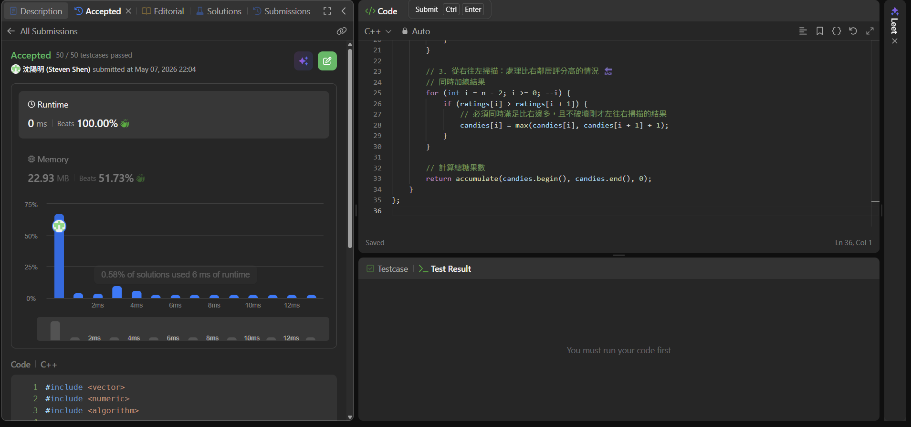

## Code (C++)

```cpp
#include <vector>
#include <numeric>
#include <algorithm>

using namespace std;

class Solution {
public:
    int candy(vector<int>& ratings) {
        int n = ratings.size();
        if (n <= 1) return n;

        // 1. 初始化：每人至少 1 顆糖 🍬
        vector<int> candies(n, 1);

        // 2. 從左往右掃描：處理比左鄰居評分高的情況
        for (int i = 1; i < n; ++i) {
            if (ratings[i] > ratings[i - 1]) {
                candies[i] = candies[i - 1] + 1;
            }
        }

        // 3. 從右往左掃描：處理比右鄰居評分高的情況 🔙
        // 同時加總結果
        for (int i = n - 2; i >= 0; --i) {
            if (ratings[i] > ratings[i + 1]) {
                // 必須同時滿足比右邊多，且不破壞剛才左往右掃描的結果
                candies[i] = max(candies[i], candies[i + 1] + 1);
            }
        }

        // 計算總糖果數
        return accumulate(candies.begin(), candies.end(), 0);
    }
};
```
## Acceptance Screen Shot
