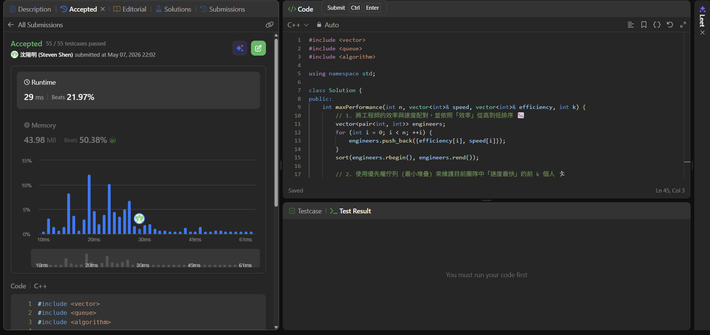

## Code (C++)

```cpp
#include <vector>
#include <queue>
#include <algorithm>

using namespace std;

class Solution {
public:
    int maxPerformance(int n, vector<int>& speed, vector<int>& efficiency, int k) {
        // 1. 將工程師的效率與速度配對，並依照「效率」從高到低排序 📉
        vector<pair<int, int>> engineers;
        for (int i = 0; i < n; ++i) {
            engineers.push_back({efficiency[i], speed[i]});
        }
        sort(engineers.rbegin(), engineers.rend());

        // 2. 使用優先權佇列 (最小堆疊) 來維護目前團隊中「速度最快」的前 k 個人 🏃‍♂️
        priority_queue<int, vector<int>, greater<int>> minHeap;
        
        long long speedSum = 0; // 團隊總速度
        long long maxPerf = 0;  // 最大表現值
        const int MOD = 1e9 + 7;

        for (auto& eng : engineers) {
            int currEff = eng.first;
            int currSpd = eng.second;

            // 如果團隊滿了，踢掉速度最慢的人，空出位置給目前這位（或者不加他）
            if (minHeap.size() == k) {
                speedSum -= minHeap.top();
                minHeap.pop();
            }

            // 將當前工程師加入團隊
            minHeap.push(currSpd);
            speedSum += currSpd;

            // 計算當前表現值：(當前總速度) * (當前最差效率，即目前的 currEff)
            // 每次更新都取最大值
            maxPerf = max(maxPerf, speedSum * currEff);
        }

        return maxPerf % MOD;
    }
};
```
## Acceptance Screen Shot

