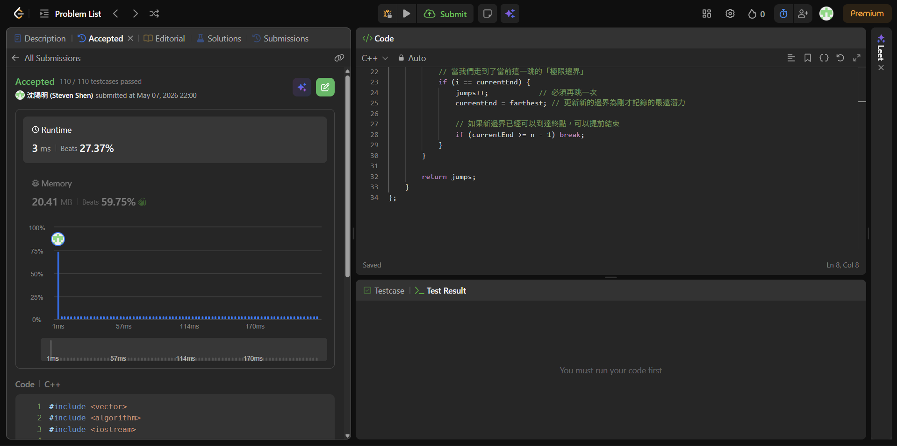

## Code (C++)

```cpp
#include <vector>
#include <algorithm>
#include <iostream>

using namespace std;

class Solution {
public:
    int jump(vector<int>& nums) {
        int n = nums.size();
        if (n <= 1) return 0;

        int jumps = 0;      // 記錄跳躍次數 👟
        int currentEnd = 0; // 當前跳躍能到達的最遠邊界 🚧
        int farthest = 0;   // 下一步跳躍能到達的最遠位置 🚩

        // 我們不需要遍歷最後一個元素，因為一旦到達或超過最後一個邊界，任務就完成了
        for (int i = 0; i < n - 1; ++i) {
            // 在當前能到達的範圍內，不斷更新「下一跳」能去的最遠地方
            farthest = max(farthest, i + nums[i]);

            // 當我們走到了當前這一跳的「極限邊界」
            if (i == currentEnd) {
                jumps++;            // 必須再跳一次
                currentEnd = farthest; // 更新新的邊界為剛才記錄的最遠潛力
                
                // 如果新邊界已經可以到達終點，可以提前結束
                if (currentEnd >= n - 1) break;
            }
        }

        return jumps;
    }
};
```
## Acceptance Screen Shot
