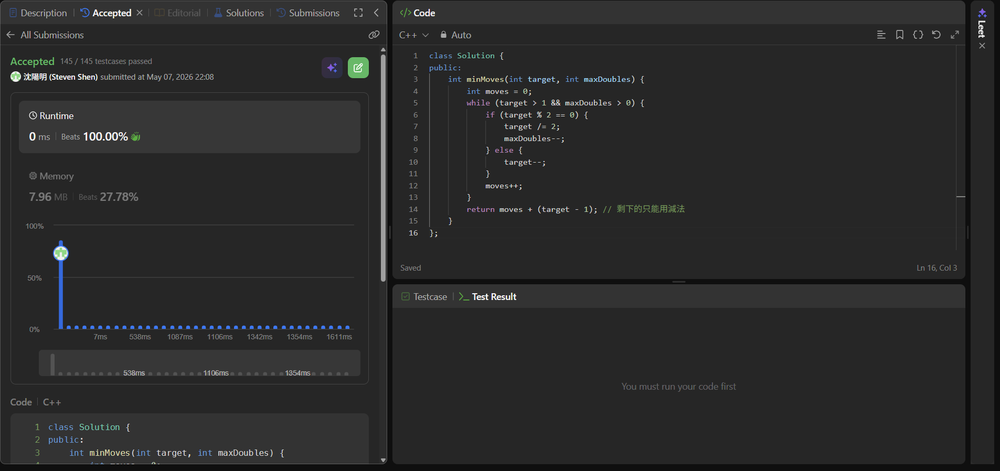

## Code (C++)

```cpp
class Solution {
public:
    int minMoves(int target, int maxDoubles) {
        int moves = 0;
        while (target > 1 && maxDoubles > 0) {
            if (target % 2 == 0) {
                target /= 2;
                maxDoubles--;
            } else {
                target--;
            }
            moves++;
        }
        return moves + (target - 1); // 剩下的只能用減法
    }
};
```
## Acceptance Screen Shot
