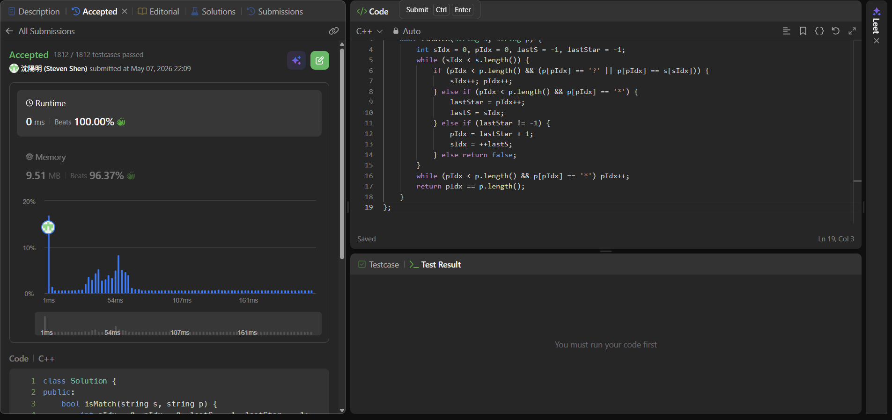

## Code (C++)

```cpp
class Solution {
public:
    bool isMatch(string s, string p) {
        int sIdx = 0, pIdx = 0, lastS = -1, lastStar = -1;
        while (sIdx < s.length()) {
            if (pIdx < p.length() && (p[pIdx] == '?' || p[pIdx] == s[sIdx])) {
                sIdx++; pIdx++;
            } else if (pIdx < p.length() && p[pIdx] == '*') {
                lastStar = pIdx++;
                lastS = sIdx;
            } else if (lastStar != -1) {
                pIdx = lastStar + 1;
                sIdx = ++lastS;
            } else return false;
        }
        while (pIdx < p.length() && p[pIdx] == '*') pIdx++;
        return pIdx == p.length();
    }
};
```
## Acceptance Screen Shot
