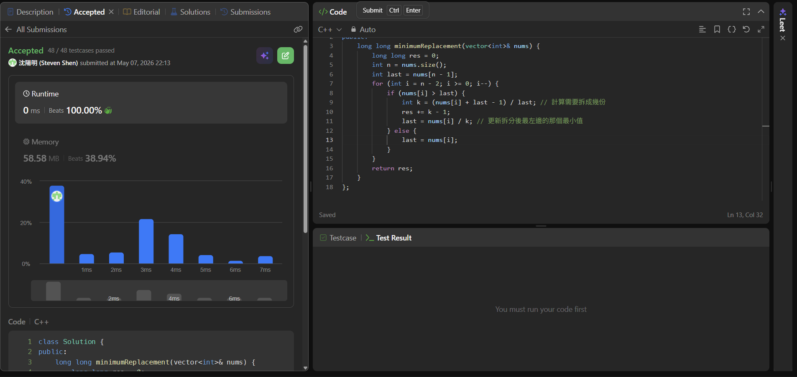

## Code (C++)

```cpp
class Solution {
public:
    long long minimumReplacement(vector<int>& nums) {
        long long res = 0;
        int n = nums.size();
        int last = nums[n - 1];
        for (int i = n - 2; i >= 0; i--) {
            if (nums[i] > last) {
                int k = (nums[i] + last - 1) / last; // 計算需要拆成幾份
                res += k - 1;
                last = nums[i] / k; // 更新拆分後最左邊的那個最小值
            } else {
                last = nums[i];
            }
        }
        return res;
    }
};
```
## Acceptance Screen Shot
