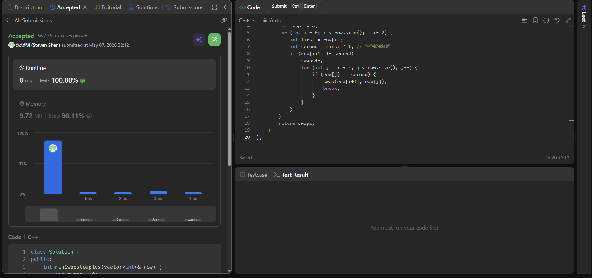

## Code (C++)

```cpp
class Solution {
public:
    int minSwapsCouples(vector<int>& row) {
        int swaps = 0;
        for (int i = 0; i < row.size(); i += 2) {
            int first = row[i];
            int second = first ^ 1; // 伴侶的編號
            if (row[i+1] != second) {
                swaps++;
                for (int j = i + 2; j < row.size(); j++) {
                    if (row[j] == second) {
                        swap(row[i+1], row[j]);
                        break;
                    }
                }
            }
        }
        return swaps;
    }
};
```
## Acceptance Screen Shot
